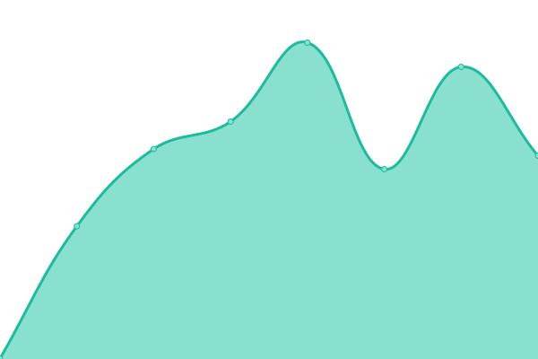

# TXMS Status

This repository contains the open-source uptime monitor and status page for [Gate Status](https://txms.info).

<!--start: status pages-->
<!-- This summary is generated by Upptime (https://github.com/upptime/upptime) -->
<!-- Do not edit this manually, your changes will be overwritten -->
<!-- prettier-ignore -->
| URL | Status | History | Response Time | Uptime |
| --- | ------ | ------- | ------------- | ------ |
|  DataLayer - Core Devín | 🟩 Up | [data-layer-core-devin.yml](https://github.com/rastislavcore/txms/commits/HEAD/history/data-layer-core-devin.yml) | 

 493ms
     
 | 

<a href="https://txms.info/history/data-layer-core-devin">100.00%</a>
    

|  DataLayer - Core Mainnet | 🟩 Up | [data-layer-core-mainnet.yml](https://github.com/rastislavcore/txms/commits/HEAD/history/data-layer-core-mainnet.yml) | 

 1752ms
     
 | 

<a href="https://txms.info/history/data-layer-core-mainnet">100.00%</a>
    

<!--end: status pages-->

[**Visit our status website →**](https://txms.info)

## 📄 License

- Powered by: [Upptime](https://github.com/upptime/upptime)
- Code: [MIT](./LICENSE) © [Gate Status](https://txms.info)
- Data in the `./history` directory: [Open Database License](https://opendatacommons.org/licenses/odbl/1-0/)
